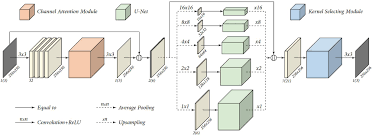

# Extreme-Low-Light-Denoiser-Net

## Overview

This project implements a neural network based on the Pyramid Real Image Denoising Network (PRIDNet) structure for denoising low-light images. The network is built using PyTorch and has been scaled down from the original PriDNet architecture to suit the specific requirements of this project.

## PRIDNet Structure



The PRIDNet (Pyramid Real Image Denoising Network) architecture is designed to effectively remove noise from real images, particularly those captured in low-light conditions. The network employs a pyramid structure that progressively refines the image resolution while denoising, allowing it to handle noise at multiple scales.

## Implementation Details

- **Framework**: PyTorch
- **Model**: Scaled-down PriDNet
- **Epochs**: 300
- **Performance**: Achieved an accuracy of approximately 18.93 dB on the testing data

## Getting Started

### Prerequisites

- Python 3.8+
- PyTorch 1.8+
- Jupyter Notebook

### Training the Model

1. Prepare your dataset and place it in the `Train/` directory.

2. Run the training script:
   ```bash
   python Main.py
   ```
## Results

After training the model for 300 epochs, it achieved an accuracy of approximately 18.93 dB on the testing data. Further improvements can be made by fine-tuning the model and experimenting with different hyperparameters.

## Acknowledgements

- [Original PRIDNet Paper](https://arxiv.org/pdf/1908.00273)
